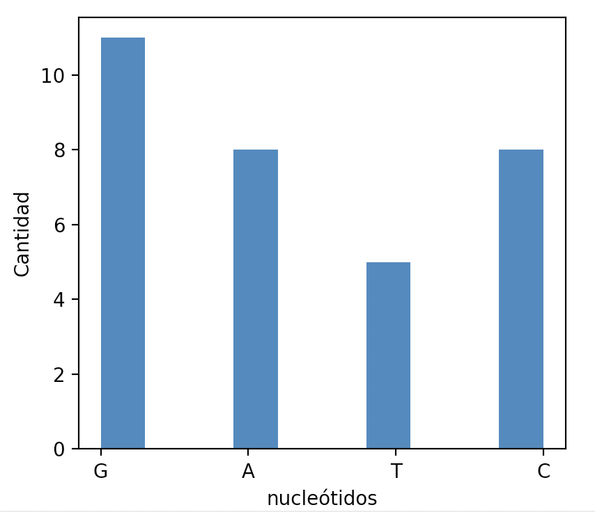

# Taller de Bioinformática


## Qué es bioinformática? 👩🏻‍🔬
La bioinformática es una rama de las ciencias que combina el estudio de sistemas biológicos, con técnologías computacionales.

### Qué se intenta resolver?
Los principales esfuerzos de investigación en estos campos incluyen:
* el alineamiento de secuencias 
* la predicción de genes
* montaje del genoma
* alineamiento estructural de proteínas
* predicción de estructura de proteínas
* predicción de la expresión génica
* interacciones proteína-proteína
* modelado de la evolución
* ... entre otros


En este taller aprenderemos un poco de cómo se estudian las sequencias de ADN, mediante la manipulación de cadenas de texto que representan genomas pequeños de organismos bacteriales.


Utilizar un cuaderno online de [Jupyter](http://jupyter.org/try) para este taller. En el cual pueden resolver los problemas en python, en una especie de cuaderno científico. 


## Ejercicio 1: Cambiar orientación 

Las sequencias de ADN tienen una dirección según la orientación química de los átomos de carbono de la cadena de azúcar. Esta dirección va de 5' a 3'

Es decir: 

    5' --> 3'             3' <-- 5'
    TCATGGAA              AAGGTACT

**Crear con python** una función que permita cambiar la orientación de una cadena de ADN, independientemente de su longitud.

```python
def cambiar_orientacion(cadena):
    # Aquí se escribe la lógica de la función
    return nueva_cadena

cinco_a_tres = 'TCATGGAA'
tres_a_cinco = cambiar_orientacion(cinco_a_tres)
print tres_a_cinco
```

## Ejercicio 2: Encontrar la cadena complementaria

Cada nucleótido en el ADN contiene una de cuatro posibles bases nitrogenadas: adenina (A), guanina (G) citosina (C) y timina (T).
Y estos se organizan por pares de modo que **A** siempre se une a **T**, y **C** con **G**:


**Crear con python** una función que permita encontrar la cadena complementaria de una secuencia de ADN.

## Ejercicio 3: Encontrar la mutación

Comparar una secuencia de ADN con el genoma de referencia e imprimir las mutaciones que encuentre:

```python
def encontrar_mutaciones(referencia, secuencia):
    # Aquí se escribe la lógica de la función
    

genoma_referencia = 'TGAGATGCTCA'
secuencia = 'TGAGATTCTCA'

encontrar_mutaciones(genoma_referencia, secuencia)
```

Debe imprimir:

`Hay una mutación de G -> T` 
o 

`Hay una mutación de G -> T en la posición 6` 

## Ejercicio 4: Conteo de nucléotidos

**Crear con python** una función que cuente el número de núcleotidos en una cadena de ADN.

```python
def contar_nucleotidos(cadena):
    # Aquí se escribe la lógica de la función

cadena = 'GATGATGAGAGCGCCGATCAGCGTGCCCATGA'
contar_nucleotidos(cadena)
```

Debe imprimir en pantalla:
``` 
Hay 8 adeninas
Hay 5 guaninas
Hay 8 citocinas
Hay 11 timinas
```

**RETO Extra**: Gráficar en un histograma



## Ejercicio 5: Encontrar patrones en una secuencia

Encontrar la posición de una secuencia corta en una cadena larga de ADN:

**Ejemplo**: Encontrar la posición de la secuencia **GCG** en la cadena ACACACCTT**GCG**CCGCATACAATT

```python
def encontrar_posicion(cadena, patron):
    # Escribir la lógica de la función aquí

cadena = 'ACACACCTTGCGCCGCATACAATT'
patron = 'GCG'

encontrar_posicion(cadena, patron)
```
Imprimiría:

`La posición es 9`

## Ejercicio 6: Contar secuencias patrones

Contar el número de veces que cierto patrón se repite en una secuencia:

**Ejemplo**: Encontrar el número de veces que la secuencia **ATA** está en la cadena **ACACA**CCTTGCGCCGCAT**ACA**ATT

En este caso se encontaría 3 veces.

## Ejercicio 7: Transcripción de ADN a ARN

En ADN hay: A, T, C y G. Pero en ARN no hay T (Tiamina), sino Uracilo (U) como reemplazo. 
Es decir, que en estos casos se organizan por pares de modo que **A** siempre se une a **U**, y **C** con **G**:

Es decir:
```
    A <--> U
    C <--> G
```


**Crear con python** una función que permita encontrar la cadena de ARN que se transcribe a partir de una secuencia de ADN.

**Ejemplo**:

        ADN --> 'TACTAGATCC'
        ARN --> 'AUGAUCUAGG'


## PROYECTO CON GENOMA REAL

Para este proyecto descargar el genoma de Vibrio Colera:

http://bioinformaticsalgorithms.com/data/realdatasets/Replication/Vibrio_cholerae.txt

Hay dos formas de importar el genoma con python para guardar en una variable:

1. Haciendo un llamado al link del archivo con `requests`

```python
import requests

link_del_archivo = ''
genome = requests.get(link_del_archivo).text
```

2. Descargando el archivo de texto, guardándolo en una carpeta y utilizar esa locacion del archivo para abrirlo con la función `open`

```python
locacion_del_archivo = ''
genoma = open(link_del_archivo)
```

### Actividad

- Cuántos nucleótidos tiene el genoma?
- Cuántos A,C,G,T?
- Encontrar la posición de la secuencia que transcribe el codón de INICIO `AUG`


Importar el genoma y encontrar la secuencia de proteinas que se codificaría:


